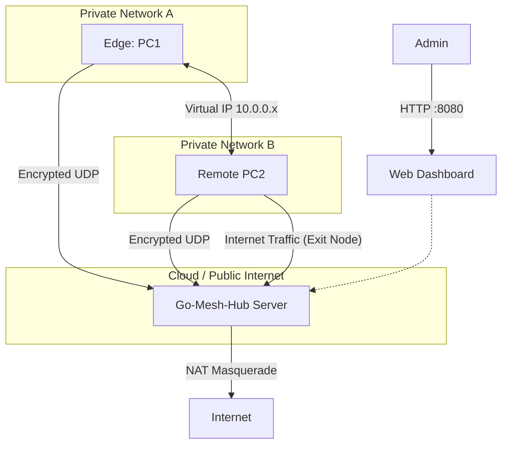

# Go-Mesh-Hub 🌐


**Go-Mesh-Hub** is an enterprise-grade, secure VPN orchestrator and overlay network written in Go. It enables seamless, bidirectional communication between devices behind restrictive NATs, CGNATs, and Firewalls without requiring manual port forwarding on edge devices.

Unlike traditional P2P VPNs, Go-Mesh-Hub supports **Hub & Spoke** topology with flexible routing modes: **Split Tunneling** (Mesh only) and **Full Tunneling** (Exit Node / Gateway), making it ideal for IoT Fleets, Edge Computing, and secure home lab remote access.

## 🚀 Key Features

### 🛡️ Core Capabilities

  * **Hub & Spoke Topology:** Centralized signaling with highly efficient UDP tunneling.
  * **Exit Node Support (Full Tunneling):** Turn your Hub into a secure Gateway. Route internet traffic from agents through the Hub to mask public IPs or access geo-restricted content.
  * **Zero-Config Edge:** Agents automatically traverse NATs using **UDP Hole Punching** and persistent Keep-Alives.
  * **Self-Healing Network Stack:** Automated management of `iptables` NAT/Masquerade rules and `ip_forward` policies. Includes idempotent rule application and graceful shutdown cleanup to prevent routing conflicts.

### 🔐 Security & Performance

  * **Military-Grade Encryption:** All traffic is encapsulated and encrypted using **ChaCha20-Poly1305** (AEAD) with cryptographically secure nonces to prevent replay attacks.
  * **Layer 3 Tunneling:** Utilizes a standard `TUN` interface, supporting ICMP (Ping), TCP (SSH, HTTP), and UDP natively.
  * **High Performance:** Written in pure Go using raw syscalls and user-space networking for minimal overhead.

### 👁️ Observability

  * **Real-Time Dashboard:** Embedded web interface for monitoring peer status, real-time bandwidth usage (Rx/Tx), and latency.
  * **Smart Build System:** Automated cross-compilation for Intel/AMD and ARM architectures (NVIDIA Jetson, Raspberry Pi) via `setup.sh`.

-----
## 🏗️ Architecture

The system operates by creating a virtual overlay network. Packets destined for the VPN are intercepted by the `TUN` interface, encrypted in user-space, and encapsulated in UDP packets for transport over the public internet.


### Packet Flow (Simplified)

1.  **Application** sends a packet to `10.0.0.2` (Peer) or `8.8.8.8` (Internet).
2.  **Kernel** routes packet to `tun0` interface.
3.  **Go-Mesh-Hub** reads the raw IP packet from `tun0`.
4.  **Crypto Engine** encrypts the payload (ChaCha20-Poly1305).
5.  **Transport Layer** wraps the encrypted data in UDP and transmits to the Hub's physical IP.
6.  **Hub** decrypts and either routes to another Peer (Mesh) or acts as a NAT Gateway to the Internet (Exit Node).

-----

## 🛠️ Installation & Setup

### Prerequisites

  * **Linux OS** (Debian, Ubuntu, Arch, Alpine, etc.)
  * **Root privileges** (Required to create `TUN` interfaces and modify `iptables`).

### Automated Setup

Our bootstrap script automatically detects your CPU architecture (AMD64, ARM64, ARMv7), installs Go if missing, and builds the binaries.

```bash
git clone https://github.com/nicoRomeroCuruchet/Go-Mesh-Hub.git
cd Go-Mesh-Hub
chmod +x setup.sh
./setup.sh
```
3.  **Done\!** Binaries are located in the `bin/` directory.
-----
## ⚙️ Deployment Guide

### Scenario 1: Standard Mesh (P2P Communication)

In this mode, devices can talk to each other (e.g., SSH, ping, etc.), but internet traffic uses the device's own local connection. Deploy this on a machine with a Public IP or with UDP Port 45678 forwarded.

**1. Start the Hub (Server)**

```bash
# Run on a machine with a Public IP
sudo ./bin/hub \
  -local-port 45678 \
  -web-port 8080 \
  -tun-ip 10.0.0.1 \
  -secret "my-password"
```

**2. Start an Agent (Client)**

```bash
sudo ./bin/agent \
  -hub-ip <HUB_PUBLIC_IP> \
  -hub-port 45678 \
  -tun-ip 10.0.0.2 \
  -secret "my-password"
```

### Scenario 2: Exit Node (VPN Gateway)

In this mode, the Hub acts as a gateway. Agents can route **all their internet traffic** through the Hub, securing their connection on public WiFi or accessing restricted networks.

**1. Start the Hub with Exit Node Enabled**
Note the `-exit-node` flag matching the Hub's own TUN IP. This enables the NAT engine.

```bash
sudo ./bin/hub \
  -local-port 45678 \
  -tun-ip 10.0.0.1 \
  -exit-node 10.0.0.1 \
  -secret "my-password"
```

*The Hub will automatically configure `iptables` NAT/Masquerade rules and enable IP Forwarding.*

**2. Start Agent with Global Routing**
Use the `-global-exit` flag to automatically override the default gateway on the client.

```bash
sudo ./bin/agent \
  -hub-ip <HUB_PUBLIC_IP> \
  -hub-port 45678 \
  -tun-ip 10.0.0.2 \
  -global-exit \
  -secret "my-password"
```

-----

## 📊 Monitoring Dashboard

The Hub exposes a lightweight, real-time dashboard.

  * **URL:** `http://<HUB_IP>:8080`
  * **Metrics:**
      * **Peer Status:** Online/Offline detection based on heartbeat analysis.
      * **Throughput:** Live Rx/Tx counters.
      * **NAT Info:** Displays the real WAN IP and Port of every connected peer.

-----

## 📂 Project Structure

This project follows the [Standard Go Project Layout](https://github.com/golang-standards/project-layout) for maintainability.

| Directory | Description |
| :--- | :--- |
| `cmd/` | Main applications (`hub` and `agent`). |
| `internal/tun` | Low-level OS interactions. Manages `TUN` device creation, MTU, and `iptables` NAT rules. |
| `internal/security` | Cryptographic wrapper for AEAD (ChaCha20-Poly1305) and Nonce management. |
| `internal/router` | In-memory routing table, Peer state tracking, and Split-Horizon logic. |
| `internal/dashboard` | Embedded HTML/CSS templates and HTTP handlers for the UI. |
| `bin/` | Compiled binaries. |

-----

## 🧪 Troubleshooting

**1. Handshake Failed**

  * Ensure the `-secret` is identical on both sides.
  * Check UDP port firewall rules on the Hub server (Allow UDP 45678).

**2. Internet not working via Exit Node**

  * Verify that the Hub printed `[NAT] Exit Node Enabled` on startup.
  * Check `sudo iptables -t nat -L -v` on the Hub to ensure `MASQUERADE` rules exist.
  * Ensure the client ran with `-global-exit`.

**3. Tun Interface Error**

  * Ensure you are running with `sudo`. The application needs `CAP_NET_ADMIN` to create virtual network interfaces.

## 🤝 Contributing

Contributions are welcome\! Please open an issue first to discuss what you would like to change.

1.  Fork the Project
2.  Create your Feature Branch (`git checkout -b feature/AmazingFeature`)
3.  Commit your Changes (`git commit -m 'Add some AmazingFeature'`)
4.  Push to the Branch (`git push origin feature/AmazingFeature`)
5.  Open a Pull Request

## 📄 License

Distributed under the MIT License. See `LICENSE` for more information.
